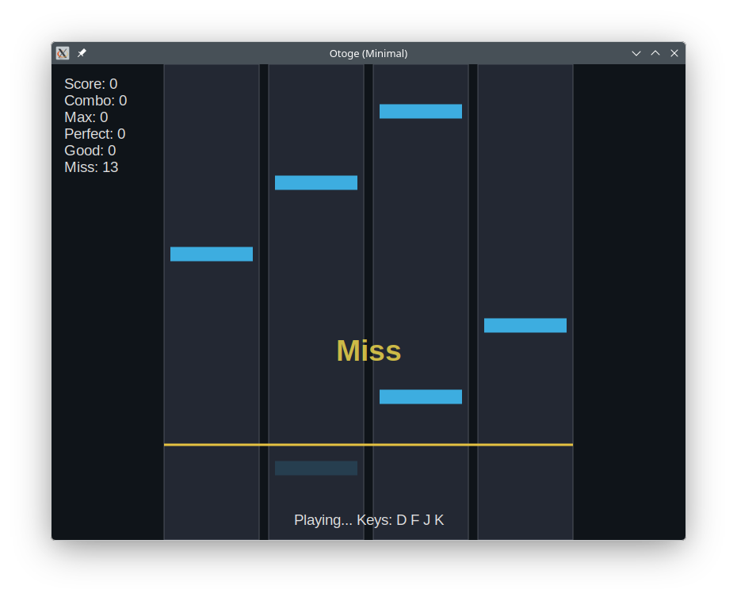

# melodica / otoge

<div><video controls src="https://github.com/kojix2/melodica/raw/refs/heads/main/assets/gymnopedie.mp4" muted="false"></video></div>

Minimal rhythm game prototypes built with Crystal and libui.

- `otoge`: 4-lane keyboard rhythm game
- `melodica`: simple melody/rhythm prototype player

Built with `uing` for UI and `raudio` for audio.

If video playback is not available in your GitHub view, use the direct link above.



## Quick Start

```bash
shards
make build release=1
bin/otoge
bin/melodica
```

## License

MIT
